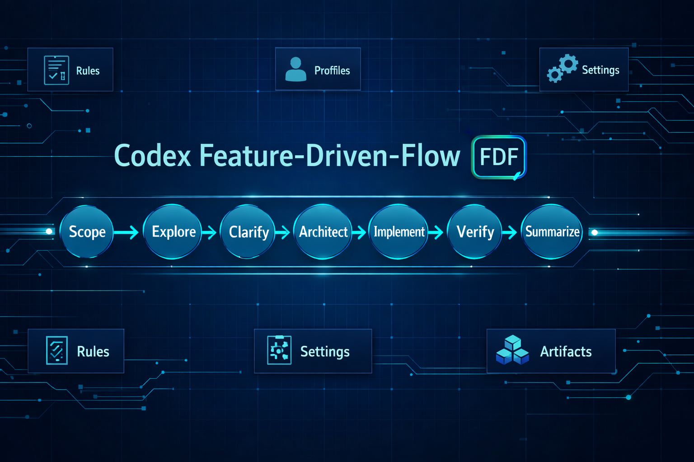
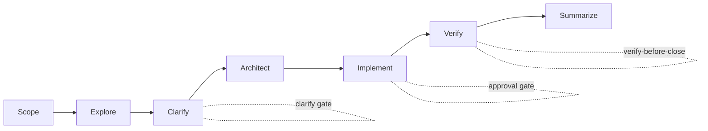

# Feature-Driven-Flow (FDF)

Version: `1.2.1`



Feature-Driven-Flow is a markdown-first AI delivery framework for non-trivial changes.  
It runs a fixed seven-phase workflow, compiles selected policies into a concrete rule matrix, and records auditable outputs through explicit gates.

This repository is the source-of-truth development repo for the framework. It contains:

1. the Codex implementation
2. the Claude Code implementation
3. the shared FDF runtime assets used by both

Published runtime repositories:

1. Codex distribution: [QuasarByte/feature-driven-flow-codex](https://github.com/QuasarByte/feature-driven-flow-codex)
2. Claude Code distribution: [QuasarByte/feature-driven-flow-claude](https://github.com/QuasarByte/feature-driven-flow-claude)

## 2-Minute Start

Choose your runtime:

1. Codex
   - install from [QuasarByte/feature-driven-flow-codex](https://github.com/QuasarByte/feature-driven-flow-codex)
   - user-facing entrypoint: `/prompts:fdf-start`
2. Claude Code
   - install from [QuasarByte/feature-driven-flow-claude](https://github.com/QuasarByte/feature-driven-flow-claude)
   - user-facing entrypoint: `/feature-driven-flow:fdf-start`
   - use the namespaced form as the supported marketplace command; bare `/fdf-start` may not be reliable across installs

Codex example:
```text
/prompts:fdf-start Create a simple console Java app that prints factorial(n). Use JDK 25 and Maven. Read n from argv.
```

Claude Code example:
```text
/feature-driven-flow:fdf-start Create a simple console Java app that prints factorial(n). Use JDK 25 and Maven. Read n from argv.
```

Optional source-repo validation before changes:
```powershell
pwsh -NoProfile -File tools/run-validation-cycle.ps1
```


## Maintainer Tooling

Maintainer scripts require PowerShell 7 (`pwsh`) to be installed on Windows, macOS, or Linux.
The `.sh` and `.cmd` wrappers are convenience entrypoints, but they still delegate to `pwsh`.

Scripts that require `pwsh`:

1. `tools/build-distribution-claude.ps1`
2. `tools/build-distribution-codex.ps1`
3. `tools/deploy-distribution-claude.ps1`
4. `tools/deploy-distribution-codex.ps1`
5. `tools/run-validation-cycle.ps1`
6. `tools/validate-fdf-assets.ps1`
7. `tools/generate-fdf-manifest.ps1`
8. `shared/fdf/scripts/convert-effective-instructions.ps1`

## What This Framework Provides

1. A stable micro-core conductor with hard invariants.
2. A rule system (`.md` files) for phase-scoped behavior.
3. Optional profile selection that compiles into a per-phase rule matrix.
4. Optional Effective Rule Matrix reuse at Scope (file path or inline block input).
5. Optional Effective Instructions reuse (directory bundle or compact file).
6. Pack-based asset bundles (rules/profiles/templates/references).
7. JSON settings with global defaults and repo-local overrides.
8. Optional persistence and async handoff artifacts.
9. Generated manifests for fast asset discovery.
10. Validation tooling and governance playbooks.

## Workflow Contract

FDF always runs in this order:

`Scope -> Explore -> Clarify -> Architect -> Implement -> Verify -> Summarize`

Mermaid overview:



Core invariants:

1. Do not reorder or skip phases.
2. Do not leave Clarify with decision-critical ambiguity.
3. Do not start Implement without explicit user approval.
4. Do not close before Verify and Summarize.

Entry points:

1. Codex prompt: `codex/prompts/fdf-start.md`
2. Claude Code slash command: `claude-code/plugins/feature-driven-flow/commands/fdf-start.md`
3. Codex conductor skill: `codex/skills/feature-driven-flow/SKILL.md`
4. Claude Code conductor skill: `claude-code/plugins/feature-driven-flow/skills/feature-driven-flow/SKILL.md`

## Repository Layout

1. `codex/`
   Codex-specific prompts, skills, and distribution README/license sources.
2. `claude-code/`
   Claude marketplace sources, plugin wrapper assets, commands, and plugin README/license sources.
3. `shared/fdf/`
   Shared runtime assets reused by both agents: settings, schemas, manifests, rules, profiles, packs, references, templates, scripts.
4. `tools/`
   Build, deploy, validation, and manifest generation scripts.
5. `docs/`
   Architecture, specification, validation, and distribution documentation.
6. `distrib/`
   Generated release artifacts for `feature-driven-flow-codex` and `feature-driven-flow-claude`.

## Architecture Overview

1. Core shared rules: `shared/fdf/skills/feature-driven-flow/extensions/rules/*.md`
2. Core shared profiles: `shared/fdf/skills/feature-driven-flow/extensions/profiles/*.md`
3. Optional packs: `shared/fdf/skills/feature-driven-flow/packs/<pack_id>/...`
4. Agent-specific wrappers:
   - Codex entrypoints and behavior: `codex/`
   - Claude Code entrypoints and behavior: `claude-code/`
5. Repo-local overlays in target repositories:
   - Codex:
     `.codex/feature-driven-flow/settings.json`  
     `.codex/feature-driven-flow/rules/*.md`  
     `.codex/feature-driven-flow/profiles/*.md`  
     `.codex/feature-driven-flow/packs/*`
   - Claude Code:
     `.claude/feature-driven-flow/settings.json`  
     `.claude/feature-driven-flow/rules/*.md`  
     `.claude/feature-driven-flow/profiles/*.md`  
     `.claude/feature-driven-flow/packs/*`

Rule precedence (high to low):

1. Core invariants.
2. `AGENTS.md` policy.
3. Settings and enabled packs.
4. User-confirmed Effective Rule Matrix.
5. Active rules (shared first, then local refinements when allowed).

## Rules, Profiles, and Matrix

Rule schema fields:

1. `id`, `title`, `applies_to_phases`, `intent`, `guidance`, `checks`, `outputs`
2. Optional: `examples`, `tags`, `requires`, `conflicts_with`

Profile model:

1. Profiles are reusable selection bundles.
2. Profiles are inputs, not runtime behavior by themselves.
3. Canonical execution artifact is the compiled matrix:
`phase -> [rule_id...]`

Further reading:

1. Specification: `docs/specification.md`
2. Core references: `shared/fdf/skills/feature-driven-flow/references/*.md`

At Scope, the conductor:

1. Infers context (strictness, change type, delivery surface, sensitivity flags).
2. If supplied by user, validates imported Effective Rule Matrix candidate (file or inline block).
3. Recommends profile selection (base + optional overlays) when no valid import is supplied.
4. Compiles and presents the phase-by-phase rule matrix as the Effective Rule Matrix.
5. Waits for user acceptance/adjustment before Explore.
6. Exports confirmed matrix when auto-generation is enabled or user asks to save/export it.
7. Can export compiled instructions as directory bundle or compact file with content mode `reference|portable|hybrid`.

## Packs Included in FDF

1. `async-collab`: persistence, async packets, portability exports.
2. `quality`: engineering principles and test strategy policy.
3. `hardening`: security/performance/operations/release/compatibility policies.
4. `presets`: convenience profiles (`baseline`, `hardened`) and overlays.
5. `observability-lite`: lightweight workflow observability notes.

Packs only affect asset availability. They do not change core invariants.

## Settings System

Canonical format: JSON (`shared/fdf/schemas/fdf-settings.schema.json`)

Settings files:

1. Shared defaults: `shared/fdf/skills/feature-driven-flow/settings.json`
2. Codex repo-local overrides: `.codex/feature-driven-flow/settings.json`
3. Claude Code repo-local overrides: `.claude/feature-driven-flow/settings.json`
4. Optional run snapshot: `<run_root_dir>/<run_id>/settings.snapshot.json`

Key settings groups:

1. `persistence` and `async_packets`
2. `exports` (`RUNBOOK.md`, `state.json`, optional conversation export)
3. `packs` (enabled packs and pack directories)
4. `local_rules`, `local_profiles`, `local_extensions`
5. `overrides`, `matrix_import`, `matrix_export`, `effective_instructions`, `evidence`, `outputs`

Default `packs.enabled` in this framework:
`["async-collab","hardening","observability-lite","presets","quality"]`

## Install

End users should install from the dedicated runtime repositories, not from this source repository.

### Codex

1. Use the packaged repo: [QuasarByte/feature-driven-flow-codex](https://github.com/QuasarByte/feature-driven-flow-codex)
2. Verify Codex CLI:
```text
codex --help
```
3. Resolve `CODEX_HOME`:
`%USERPROFILE%\.codex` (Windows) or `~/.codex` (macOS/Linux)
4. Copy assets:
`skills/* -> $CODEX_HOME/skills/`
`prompts/*.md -> $CODEX_HOME/prompts/`
`fdf/ -> <project-root>/fdf/`
5. Restart Codex session.

### Claude Code

1. Use the packaged repo: [QuasarByte/feature-driven-flow-claude](https://github.com/QuasarByte/feature-driven-flow-claude)
2. Add the marketplace:
```text
/plugin marketplace add QuasarByte/feature-driven-flow-claude
```
3. Install the plugin:
```text
/plugin install feature-driven-flow@quasarbyte-plugins
```

## Quick Start

Codex:

```text
/prompts:fdf-start Create a simple console Java app that prints factorial(n). Use JDK 25 and Maven. Read n from argv.
```

Claude Code:

```text
/feature-driven-flow:fdf-start Create a simple console Java app that prints factorial(n). Use JDK 25 and Maven. Read n from argv.
```

Optional explicit profile request:

```text
/prompts:fdf-start Build a small internal CLI tool. Use profile hardened and overlays security-overlay, operations-overlay.
```

Optional Effective Rule Matrix file reuse:

```text
/prompts:fdf-start Implement my feature using matrix file .codex/feature-driven-flow/effective-rule-matrix.json
```

Equivalent phrasing for import intent is supported, for example:

```text
Load matrix from .codex/feature-driven-flow/effective-rule-matrix.json
```

Optional inline matrix reuse:

```text
/prompts:fdf-start Create a simple console Java app that prints factorial(n). Use JDK 25 and Maven. Read n from argv.
Use this matrix (inline JSON block):
```

```json
{
  "schema": "fdf/effective-rule-matrix.v1",
  "fdf_version": "1.2.1",
  "created_at": "2026-03-03T00:00:00Z",
  "selected_profiles": [],
  "profile_overrides": {},
  "enabled_packs": [],
  "rule_matrix": {
    "scope": [],
    "explore": [],
    "clarify": [],
    "architect": [],
    "implement": [],
    "verify": [],
    "summarize": []
  }
}
```

Optional save/export after matrix confirmation:

```text
Save current effective matrix for reuse.
```

Optional save/export to custom path:

```text
Export active matrix to .codex/feature-driven-flow/matrices/release-candidate.json
```

Optional save/export compiled instructions (directory bundle):

```text
Export compiled instructions bundle to .codex/feature-driven-flow/effective-instructions-bundle
```

Optional save/export compiled instructions (compact file):

```text
Export compiled instructions compact to .codex/feature-driven-flow/effective-instructions-compact.json
```

Optional include user custom instructions before export:

```text
Export compiled instructions and include my custom prompts.
```

Expected decision flow:

1. Add new custom instruction(s).
2. Modify/rephrase candidate custom instruction(s).
3. Continue without custom instructions.

If `effective_instructions.export.require_custom_instructions_approval=true`, Codex must get explicit user approval before writing export files.
If `effective_instructions.export.require_all_custom_instruction_items_approved=true` (default), Codex must block or filter out non-approved custom items before export and ask whether to improve, skip unapproved, or cancel.

Optional save/export portable (embedded-content) bundle:

```text
Export portable instructions bundle to .codex/feature-driven-flow/effective-instructions-bundle-portable
```

Optional save/export portable (embedded-content) compact file:

```text
Export portable instructions compact to .codex/feature-driven-flow/effective-instructions-compact-portable.json
```

Convert bundle -> compact:

```powershell
pwsh -NoProfile -File fdf/scripts/convert-effective-instructions.ps1 -Mode directory-to-compact -InputPath .codex/feature-driven-flow/effective-instructions-bundle -OutputPath .codex/feature-driven-flow/effective-instructions-compact.json
```

Convert bundle -> compact (portable embedded-content):

```powershell
pwsh -NoProfile -File fdf/scripts/convert-effective-instructions.ps1 -Mode directory-to-compact -InputPath .codex/feature-driven-flow/effective-instructions-bundle -OutputPath .codex/feature-driven-flow/effective-instructions-compact-portable.json -ContentMode portable
```

Convert compact -> bundle:

```powershell
pwsh -NoProfile -File fdf/scripts/convert-effective-instructions.ps1 -Mode compact-to-directory -InputPath .codex/feature-driven-flow/effective-instructions-compact.json -OutputPath .codex/feature-driven-flow/effective-instructions-bundle
```

If user says only `save state` or `export compiled state`, Codex should ask whether you mean Effective Rule Matrix export, Effective Instructions export, or `state.json` export.

## Portability Notice

1. `reference` mode keeps artifacts small, but depends on local repository paths/files.
2. `portable` mode embeds source content and is better for cross-environment sharing.
3. `hybrid` mode includes both references and embedded content.
4. `portable|hybrid` artifacts are larger and can expose sensitive/internal source material. Review before sharing externally.
5. By default, portable/hybrid embeds only provenance-listed files (`embed_only_referenced_sources=true`), so review for completeness.
6. Artifacts can include `custom_instructions` with approval metadata for reusable user-defined prompts/phrases/rules.

## User Commands

Available Codex utility prompts in this repository:

1. `/prompts:fdf-import-effective-matrix <path-or-inline-hint>`
2. `/prompts:fdf-export-effective-matrix [output-path]`
3. `/prompts:fdf-import-effective-instructions-bundle [bundle-dir]`
4. `/prompts:fdf-export-effective-instructions-bundle [bundle-dir]`
5. `/prompts:fdf-import-effective-instructions-compact [compact-json-file]`
6. `/prompts:fdf-export-effective-instructions-compact [compact-json-file]`
7. `/prompts:fdf-import-effective-instructions-bundle-portable [bundle-dir]`
8. `/prompts:fdf-export-effective-instructions-bundle-portable [bundle-dir]`
9. `/prompts:fdf-import-effective-instructions-compact-portable [compact-json-file]`
10. `/prompts:fdf-export-effective-instructions-compact-portable [compact-json-file]`
11. `/prompts:fdf-show-effective-matrix`
12. `/prompts:fdf-diff-effective-matrix <old> <new>`
13. `/prompts:fdf-validate-effective-artifacts [path]`
14. `/prompts:fdf-convert-effective-instructions <from> <to> [input] [output]`
15. `/prompts:fdf-refresh-effective-instructions [bundle|compact] [output-path]`
16. `/prompts:fdf-explain-effective-instructions`
17. `/prompts:fdf-doctor-effective-reuse`
18. `/prompts:fdf-preview-scope-candidates`

Examples:

```text
/prompts:fdf-import-effective-matrix .codex/feature-driven-flow/effective-rule-matrix.json
/prompts:fdf-export-effective-matrix .codex/feature-driven-flow/effective-rule-matrix.json
/prompts:fdf-import-effective-instructions-bundle .codex/feature-driven-flow/effective-instructions-bundle
/prompts:fdf-export-effective-instructions-bundle .codex/feature-driven-flow/effective-instructions-bundle
/prompts:fdf-import-effective-instructions-compact .codex/feature-driven-flow/effective-instructions-compact.json
/prompts:fdf-export-effective-instructions-compact .codex/feature-driven-flow/effective-instructions-compact.json
/prompts:fdf-import-effective-instructions-bundle-portable .codex/feature-driven-flow/effective-instructions-bundle-portable
/prompts:fdf-export-effective-instructions-bundle-portable .codex/feature-driven-flow/effective-instructions-bundle-portable
/prompts:fdf-import-effective-instructions-compact-portable .codex/feature-driven-flow/effective-instructions-compact-portable.json
/prompts:fdf-export-effective-instructions-compact-portable .codex/feature-driven-flow/effective-instructions-compact-portable.json
/prompts:fdf-show-effective-matrix
/prompts:fdf-diff-effective-matrix .codex/feature-driven-flow/old.json .codex/feature-driven-flow/new.json
/prompts:fdf-validate-effective-artifacts
/prompts:fdf-convert-effective-instructions bundle compact .codex/feature-driven-flow/effective-instructions-bundle .codex/feature-driven-flow/effective-instructions-compact.json
/prompts:fdf-refresh-effective-instructions compact .codex/feature-driven-flow/effective-instructions-compact.json
/prompts:fdf-explain-effective-instructions
/prompts:fdf-doctor-effective-reuse
/prompts:fdf-preview-scope-candidates
```

Enable packs in target repo settings (example):

```json
{
  "packs": {
    "enabled": ["async-collab", "hardening", "observability-lite", "presets", "quality"]
  }
}
```

## Persistence and Async Team Handoff

When enabled (typically via `async-collab` pack), run artifacts are written under:

`<run_root_dir>/<run_id>/...`

Typical outputs:

1. Phase files: `01-scope.md` ... `07-summarize.md`
2. Shared logs: `decision-log.md`, `risk-register.md`, `open-questions.md`, `traceability.md`
3. Team packets: `<packets_dir>/...`
4. Exports: `RUNBOOK.md`, `state.json`, optional `conversation-export.md`

## Manifests and Asset Indexing

Generated manifests provide machine-readable asset discovery.

1. Combined: `shared/fdf/skills/feature-driven-flow/extensions/manifest.json`
2. Core pack: `shared/fdf/skills/feature-driven-flow/manifest.json`
3. Per-pack: `shared/fdf/skills/feature-driven-flow/packs/<pack_id>/manifest.json`

Regenerate:

```powershell
pwsh -NoProfile -File tools/generate-fdf-manifest.ps1
```

## Validation

Use PowerShell 7 (`pwsh`) for repo tooling.

Full validation cycle (recommended):

```powershell
pwsh -NoProfile -File tools/run-validation-cycle.ps1
```

Strict gate (fails if worktree is dirty):

```powershell
pwsh -NoProfile -File tools/run-validation-cycle.ps1 -FailOnDirtyWorktree -SkipManifestRegeneration
```

Asset validation:

```powershell
pwsh -NoProfile -File tools/validate-fdf-assets.ps1
```

Validation playbook:
`docs/validation-types-playbook.md`

## Glossary

1. Effective Rule Matrix: the confirmed per-phase list of active rule ids (`phase -> [rule_id...]`).
2. Effective Instructions: compiled per-phase instruction text derived from the confirmed matrix (bundle or compact format).
3. Content mode (`reference|portable|hybrid`): how Effective Instructions store sources (paths only vs embedded content).
4. Custom instructions: optional user-defined prompts/phrases stored in Effective Instructions for reuse, with explicit approval.

## Internal Specialist Skills

1. `codex/skills/fdf-code-explorer`: behavior tracing and dependency map.
2. `codex/skills/fdf-implementation-planner`: implementation strategy and sequencing.
3. `codex/skills/fdf-change-auditor`: verification and risk-focused audit.

These are internal accelerators and implementation assets; prompts are the supported user-facing interface and active phase rules remain authoritative.

Delegation guidance:

1. Claude Code can reasonably run these specialist roles as subagents when the task is bounded and context-heavy.
2. Codex should treat them as reusable instruction modules first and use child agents only for larger bounded tasks.

## Repository Map

1. Specification: `docs/specification.md`
2. Core references: `shared/fdf/skills/feature-driven-flow/references/*.md`
3. Templates: `shared/fdf/skills/feature-driven-flow/templates/*.md`
4. Schemas: `shared/fdf/schemas/*.json`
5. Tools: `tools/*.ps1`
6. Validation playbook: `docs/validation-types-playbook.md`

## Troubleshooting

1. Prompt missing:
verify `fdf-start.md` is in `$CODEX_HOME/prompts` and restart session.
2. Packs not available:
check `packs.enabled` and manifest presence under pack directories.
3. Validation script errors under Windows PowerShell:
run scripts with `pwsh` (PowerShell 7).
4. Phase blocked:
inspect active rule `checks`, then resolve missing inputs/decisions.
5. Imported matrix rejected:
ensure file/inline content matches `shared/fdf/schemas/fdf-effective-matrix.schema.json` and uses valid rule ids/phases.
6. Matrix was not auto-saved:
check `matrix_export.auto_generate_on_scope_confirmed` (default `false`) in settings.
7. Compiled instructions import/export rejected:
check `shared/fdf/schemas/fdf-effective-instructions-bundle.schema.json`, `shared/fdf/schemas/fdf-effective-instructions-compact.schema.json`, portable schema variants, and `effective_instructions.*` settings (`content_mode`, `accept_content_modes`).

## Creator

LinkedIn: https://www.linkedin.com/in/taluyev/
