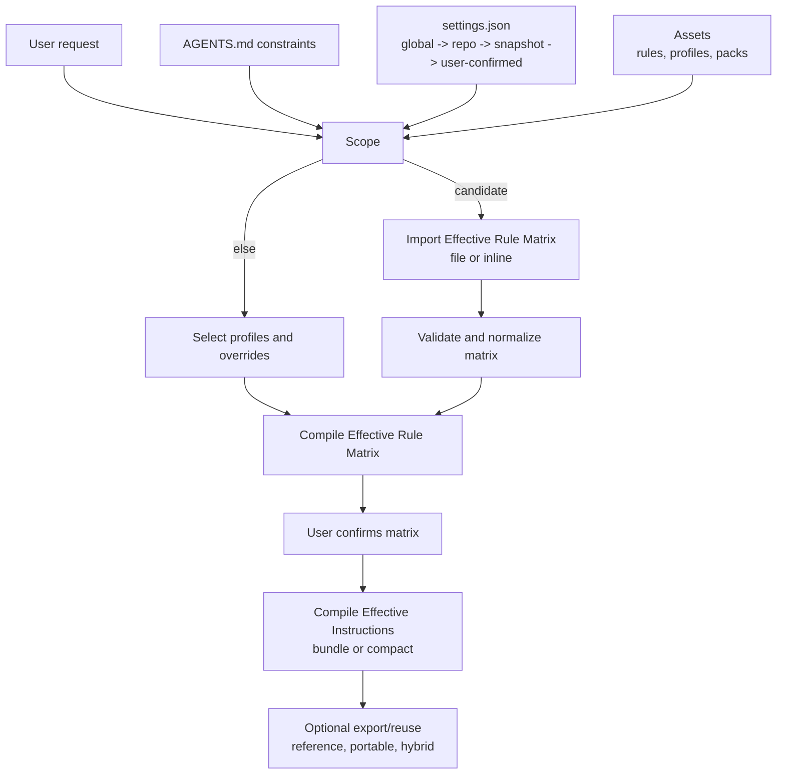
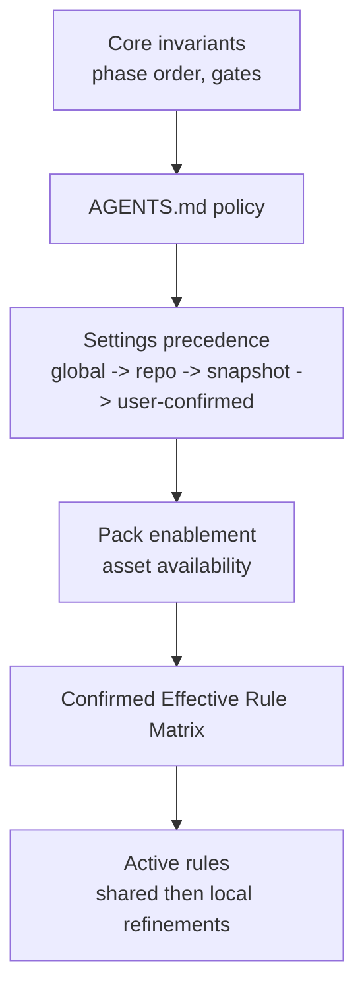

# Feature-Driven-Flow Specification

Date: 2026-03-04
Repository: `feature-driven-flow`

## 1. Purpose

This document is the runtime and artifact specification for Feature-Driven-Flow (FDF).

Use it for:

1. workflow semantics
2. rule, profile, and matrix behavior
3. artifact contracts
4. settings and precedence
5. local customization model

Use other docs for:

1. repository and packaging layout: `docs/fdf-cross-agent-architecture.md`
2. validation procedures: `docs/validation-types-playbook.md`
3. Claude release repo details: `docs/distribution/claude-feature-driven-flow-repo-spec.md`

Feature-Driven-Flow (FDF) is a markdown-first workflow package for running non-trivial feature delivery in a consistent, auditable way using an LLM agent.

## 2. Core Concepts

### 2.1 Phases

FDF always runs 7 phases in fixed order:

`Scope -> Explore -> Clarify -> Architect -> Implement -> Verify -> Summarize`

Phase intent and hard stops are documented in:

`shared/fdf/skills/feature-driven-flow/references/phases.md`

### 2.2 Rules

A rule is a phase-scoped policy unit defined in markdown. Rules:

1. declare where they apply (`applies_to_phases`)
2. provide phase guidance
3. define verifiable `checks` used to derive phase checklists
4. define required `outputs`

Rule schema: `shared/fdf/skills/feature-driven-flow/references/rule-model.md`

### 2.3 Profiles

A profile is a reusable policy bundle that selects rules and compiles down to a phase-by-phase rule matrix.

Key principle: profiles are inputs; the compiled rule matrix is the canonical execution plan.

Profile schema: `shared/fdf/skills/feature-driven-flow/references/profile-model.md`

Conventions:

1. Base profile ~= `strictness` level (`lean|baseline|hardened`)
2. Overlay profile ~= `concern` surface (`security|performance|operations|release|testing|compatibility|...`)

### 2.4 Effective Rule Matrix (Canonical Execution Artifact)

The "rule matrix" is the phase-by-phase list of rule IDs selected for the run:

`phase -> [rule_id...]`

It is:

1. imported and validated in Scope when user supplies candidate (file or inline block), otherwise proposed in Scope
2. explicitly confirmed by the user in Scope
3. used for phase execution and checklist derivation
4. recorded for traceability

Matrix change after Scope requires:

1. before/after diff
2. explicit approval

Template: `shared/fdf/skills/feature-driven-flow/templates/rule-matrix-diff.md`

### 2.4.1 Resolution Pipeline (Assets -> Matrix -> Instructions)

### 2.5 Effective Matrix Reuse Artifact

To reduce token usage and improve session portability, FDF supports reusable Effective Rule Matrix artifacts.

Canonical template:

`shared/fdf/skills/feature-driven-flow/templates/effective-rule-matrix.json`

Schema:

`shared/fdf/schemas/fdf-effective-matrix.schema.json`

Input modes at Scope:

1. file path to artifact
2. inline multiline block in prompt/chat

Interpretation hints:

1. "load/import/use/read/reuse matrix" are equivalent import intents.
2. Path-like input is treated as file-path candidate; multiline matrix content is treated as inline candidate.

Imported matrix data is a candidate input and must still pass validation and explicit user confirmation.

Export model:

1. On-demand export when user asks to save/export current|active|chosen|choice|effective|compiled matrix.
2. Optional auto-generation after Scope confirmation, controlled by settings.
3. Default auto-generation mode is disabled.
4. If user asks only for `state` or `compiled state`, system asks for clarification between Effective Rule Matrix export, Effective Instructions export, and `state.json` export.

### 2.6 Effective Instructions Reuse Artifacts

To enable cross-agent reuse (Codex, Claude Code, Gemini CLI, OpenCode, others), FDF supports reusable compiled/effective instructions artifacts.

Formats:

1. Directory bundle (canonical):
   - manifest: `bundle.manifest.json`
   - per-phase files: `phases/<phase>.md`
2. Compact single-file JSON.

Schemas:

1. `shared/fdf/schemas/fdf-effective-instructions-bundle.schema.json`
2. `shared/fdf/schemas/fdf-effective-instructions-compact.schema.json`
3. `shared/fdf/schemas/fdf-effective-instructions-bundle-portable.schema.json`
4. `shared/fdf/schemas/fdf-effective-instructions-compact-portable.schema.json`

Content modes:

1. `reference` (path/provenance references only; small artifacts; best for same environment)
2. `portable` (embedded source content; best for cross-environment transfer)
3. `hybrid` (both references and embedded content)

Optional custom instruction payload:

1. Artifacts may include `custom_instructions` to carry user-defined prompts/phrases/rules.
2. Structure includes approval decision (`none|pending|approved|rejected`) plus item list.
3. Each item carries origin/state metadata and final text.
4. Export with custom instructions requires explicit user approval when enabled by settings.
5. In strict mode (`effective_instructions.export.require_all_custom_instruction_items_approved=true`), only item-level `approved` entries may be exported; draft/rejected entries must be improved and approved, skipped, or export canceled.

Conversion support:

1. Directory bundle -> compact
2. Compact -> directory bundle
3. Tool: `shared/fdf/scripts/convert-effective-instructions.ps1`
4. Converter supports content mode: `reference|portable|hybrid|preserve`

Tradeoffs and user notice:

1. `portable|hybrid` artifacts are larger and may increase token usage during import.
2. `portable|hybrid` embeds source content and may expose sensitive internal material if shared externally.
3. `reference` mode is preferred for local same-repo workflows.
4. Before exporting portable/hybrid artifacts, user should be warned about size and data exposure risks.

### 2.7 Settings

Settings are versionable JSON used to avoid hardcoding paths/modes into rule text.

Settings locations:

1. Global defaults (this distribution):
   - `shared/fdf/skills/feature-driven-flow/settings.json`
2. Repository-local overrides (target repo):
   - `.codex/feature-driven-flow/settings.json`
3. Optional run snapshot (when persistence is enabled):
   - `<run_root_dir>/<run_id>/settings.snapshot.json`

Settings spec: `shared/fdf/skills/feature-driven-flow/references/settings.md`

Relevant matrix settings:

1. `matrix_import.*` (candidate import behavior)
2. `matrix_export.*` (auto/on-demand export behavior and default path policy)
3. `effective_instructions.import.*` (bundle/compact candidate import behavior)
4. `effective_instructions.export.*` (bundle/compact export behavior, content mode policy, and default path policy)
5. `effective_instructions.*.allow_custom_instructions` and confirmation/approval flags (custom instructions import/export behavior)

### 2.8 Packs

Packs are optional asset bundles that add rules/profiles/templates/references without modifying the micro-core.

Pack spec: `shared/fdf/skills/feature-driven-flow/references/packs.md`

Packs are enabled per repo via settings:

`"packs": { "enabled": ["pack-a", "pack-b"] }`

### 2.9 Specialist Skills (Optional)

Specialist skills are optional lenses for Explore/Architect/Verify. They must not introduce new requirements beyond active rules.

Reference: `shared/fdf/skills/feature-driven-flow/references/specialist-skills.md`

## 3. Execution Contract

### 3.1 Conductor and Prompt

Entrypoint prompt:

`codex/prompts/fdf-start.md`

Conductor skill:

`codex/skills/feature-driven-flow/SKILL.md`

Core invariants enforced by the conductor:

1. fixed phase order
2. explicit approval before Implement
3. do not leave Clarify with decision-critical ambiguity
4. Verify before Summarize
5. Decision UX: numbered options with one recommended option

### 3.2 Structured Phase Output

Each phase should produce a structured output including:

1. phase + gate_status
2. inputs, outputs
3. applied rules
4. checklist results (derived from active rules)
5. decision log, risks, artifacts, traceability, open questions

Template: `shared/fdf/skills/feature-driven-flow/templates/structured-phase-output.md`

### 3.3 Gates and Checklists

1. Phase checklist = union of `checks` from active rules in that phase (+ core invariants where applicable).
2. Checklist items are recorded as `passed|blocked|n/a` with evidence.
3. If any blocking item exists, `gate_status` must be `blocked`.
4. Phase transition requires `gate_status: ready`.

Reference: `shared/fdf/skills/feature-driven-flow/references/checklists.md`

## 4. Precedence and Conflict Resolution

Precedence (high to low):

1. Conductor skeleton invariants (phase order, approval gate, clarify gate, verify-before-summarize, decision UX).
2. Repository policy constraints in `AGENTS.md`.
3. Settings (global defaults -> repo-local overrides -> run snapshot -> user-confirmed overrides).
4. Pack enablement and available asset set (what rules/profiles/templates exist).
5. User-confirmed Effective Rule Matrix.
6. Within active rules: shared rules, then repository-local rules (local can refine shared when allowed).

Conflict handling:

1. Higher layer wins; record the override.
2. Same-layer conflicts require an explicit user decision.

Mermaid overview:

Reference: `shared/fdf/skills/feature-driven-flow/references/extension-system.md`

## 5. Scope Inference and Context Model

In Scope, FDF records structured context fields to reduce hidden assumptions and improve deterministic profile recommendations:

1. `strictness`
2. `change_type`
3. `system_shape`
4. `delivery_surface`
5. optional `compliance_mode`
6. optional sensitivity flags (`handles_sensitive_data`, `prod_operated`, `performance_critical`)

Reference: `shared/fdf/skills/feature-driven-flow/references/context-model.md`

Scope rule requiring this:

`shared/fdf/skills/feature-driven-flow/extensions/rules/scope-baseline.md`

## 6. Asset Model

### 6.1 Micro-Core Assets

Micro-core shared rules:

`shared/fdf/skills/feature-driven-flow/extensions/rules/*.md`

Micro-core shared profiles:

`shared/fdf/skills/feature-driven-flow/extensions/profiles/*.md`

Micro-core should contain:

1. phase/process baseline rules
2. governance rules for settings and packs
3. minimal templates and references needed for every run

### 6.2 Packs In This Distribution

Packs live under:

`shared/fdf/skills/feature-driven-flow/packs/<pack_id>/...`

Current packs:

1. `async-collab`: persistence + async packets + portability exports
2. `quality`: engineering principles + test strategy gate
3. `hardening`: security/performance/ops/release/compatibility rules
4. `presets`: convenience profiles (`baseline`, `hardened`, overlays) and recommendations
5. `observability-lite`: example workflow debug note rule/profile

Pack enablement is settings-driven; packs only affect which assets exist to select.

## 7. Persistence and Async Team Workflow (via Packs)

The `async-collab` pack defines persistence and async handoff behavior. It produces versionable artifacts under a run directory:

`<run_root_dir>/<run_id>/...`

Key artifacts:

1. phase files: `01-scope.md` .. `07-summarize.md`
2. shared logs: `decision-log.md`, `risk-register.md`, `open-questions.md`, `traceability.md`
3. team packets (TUI markdown): `<packets_dir>/...`
4. portability exports (optional): `RUNBOOK.md`, `state.json`, `conversation-export.md`

Reference: `shared/fdf/skills/feature-driven-flow/packs/async-collab/references/persistence.md`

## 8. Manifests

Manifests provide a machine-readable index of available assets. They are discovery and tooling inputs, not a separate behavioral source of truth.

Generated by:

`tools/generate-fdf-manifest.ps1`

Outputs:

1. Combined manifest (core + packs):
   - `shared/fdf/skills/feature-driven-flow/extensions/manifest.json`
2. Core pack manifest:
   - `shared/fdf/skills/feature-driven-flow/manifest.json`
3. Per-pack manifests:
   - `shared/fdf/skills/feature-driven-flow/packs/<pack_id>/manifest.json`

Reference: `shared/fdf/skills/feature-driven-flow/references/asset-index.md`

## 9. Validation Boundary

Validation is optional for runtime use, but recommended for contributors and release work.

This specification defines what must be true. For operational sequencing, commands, and failure triage, use `docs/validation-types-playbook.md`.

Primary validator script:

`tools/validate-fdf-assets.ps1`

It checks:

1. rule ids are unique across core + packs (+ local packs if present)
2. `applies_to_phases` uses valid phases
3. profile ids are unique across core + packs (+ local packs if present)
4. profile `always` rules reference existing rule ids
5. settings files conform to `shared/fdf/schemas/fdf-settings.schema.json`
6. effective matrix artifacts conform to `shared/fdf/schemas/fdf-effective-matrix.schema.json` (template required, repo-local optional)
7. effective instructions bundle artifacts conform to `shared/fdf/schemas/fdf-effective-instructions-bundle.schema.json` (template required, repo-local optional)
8. effective instructions compact artifacts conform to `shared/fdf/schemas/fdf-effective-instructions-compact.schema.json` (template required, repo-local optional)
9. effective instructions bundle portable artifacts conform to `shared/fdf/schemas/fdf-effective-instructions-bundle-portable.schema.json` (template required, repo-local optional)
10. effective instructions compact portable artifacts conform to `shared/fdf/schemas/fdf-effective-instructions-compact-portable.schema.json` (template required, repo-local optional)

Reference: `shared/fdf/skills/feature-driven-flow/references/asset-validation.md`

## 10. Local Customization (Target Repo)

In a target repository, local customization lives under:

1. `.codex/feature-driven-flow/settings.json` (settings overrides)
2. `.codex/feature-driven-flow/effective-rule-matrix.json` (optional reusable matrix artifact)
3. `.codex/feature-driven-flow/effective-instructions-bundle/bundle.manifest.json` (optional reusable compiled-instructions bundle)
4. `.codex/feature-driven-flow/effective-instructions-compact.json` (optional reusable compiled-instructions compact artifact)
5. `.codex/feature-driven-flow/effective-instructions-bundle-portable/bundle.manifest.json` (optional reusable compiled-instructions portable bundle)
6. `.codex/feature-driven-flow/effective-instructions-compact-portable.json` (optional reusable compiled-instructions portable compact artifact)
7. `.codex/feature-driven-flow/rules/*.md` (local rules)
8. `.codex/feature-driven-flow/profiles/*.md` (local profiles)
9. `.codex/feature-driven-flow/packs/*` (local packs; optional)

Local overlays must follow the same schemas as shared assets.

## 11. Minimal Start Recipe

1. Start the workflow:
   - `/prompts:fdf-start <feature request>`
2. In Scope:
   - confirm inferred context-model fields
   - optionally provide matrix file path or inline matrix block
   - optionally provide compiled instructions bundle/compact artifact
   - choose content mode for instructions reuse/export (`reference|portable|hybrid`)
   - validate candidate matrix (when provided)
   - validate compiled instructions candidate (when provided)
   - confirm profile selection (if packs expose profiles and compilation is needed)
   - confirm Effective Rule Matrix
   - optionally ask to export/save matrix, or enable `matrix_export.auto_generate_on_scope_confirmed`
   - optionally ask to export/save compiled instructions (bundle or compact), or enable `effective_instructions.export.auto_generate_on_scope_confirmed`
   - optionally include custom instructions in compiled-instructions export; if included, explicitly approve final custom text
   - if using portable/hybrid export, confirm sharing risk warning (embedded source content)
3. Run the phases in order, obeying gates.
4. If using team async:
   - enable `async-collab` pack via settings
   - share packet markdown via VCS/email/messenger
   - resume by pointing any agent to the run directory + `RUNBOOK.md` (when enabled)

## 12. Specialist Skills and Delegation Policy

Specialist skills are internal execution lenses, not a public API.

Rules:

1. They must not add requirements beyond active rules and conductor invariants.
2. They may be invoked inline or through delegated execution depending on agent capabilities and task shape.
3. User-facing entry remains prompts in Codex and namespaced slash commands in Claude Code marketplace installs.

Delegation guidance:

1. Claude Code may delegate specialist work to subagents when bounded isolation is useful.
2. Codex may delegate coarse-grained tasks to child agents, but specialist skills should remain instruction modules first.
3. Small or tightly coupled phase work should stay inline with the conductor.

## 13. Summary of Boundaries

Keep these boundaries explicit when editing the repo:

1. `docs/fdf-cross-agent-architecture.md` - source layout and packaging model
2. this document - runtime behavior and artifact contracts
3. `docs/validation-types-playbook.md` - validation commands and release checks